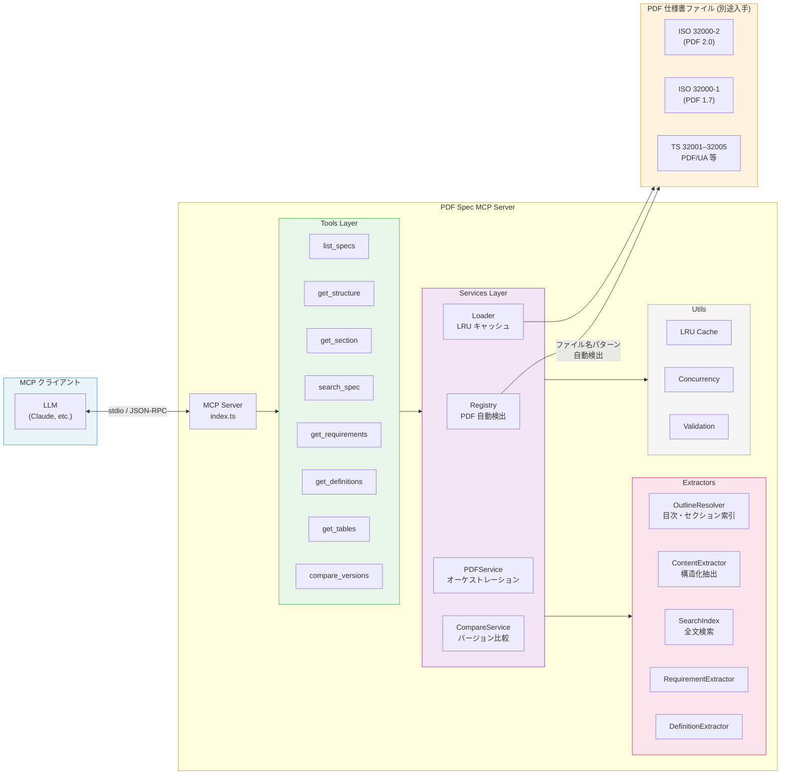

# PDF SPEC MCP Server

[](https://github.com/shuji-bonji/pdf-spec-mcp/actions/workflows/ci.yml)
[](https://www.npmjs.com/package/@shuji-bonji/pdf-spec-mcp)

[English README](README.md)

ISO 32000（PDF）仕様書への構造化アクセスを提供する MCP（Model Context Protocol）サーバーです。LLM が PDF 仕様書をナビゲート・検索・分析するためのツールを提供します。

> [!IMPORTANT]
> **PDF 仕様書ファイルは同梱されていません。**
> このサーバーを利用するには、PDF 仕様書を別途入手し、ローカルディレクトリに配置する必要があります。
>
> **入手先:** [PDF Association — Sponsored Standards](https://pdfa.org/sponsored-standards/)
>
> 詳しくは「[セットアップ](#セットアップ)」を参照してください。

## 特徴

- **マルチ仕様対応** — 最大17の PDF 関連文書を自動検出（ISO 32000-2、PDF/UA、Tagged PDF ガイド等）
- **構造化コンテンツ抽出** — 見出し・段落・リスト・テーブル・注記をセクション単位で取得
- **全文検索** — セクションコンテキスト付きキーワード検索
- **要件抽出** — ISO 規約に基づく規範的言語（shall / must / may）の抽出
- **用語定義検索** — Section 3（用語定義）からの用語検索
- **テーブル抽出** — 複数ページにまたがるテーブル検出とヘッダーマージ
- **バージョン比較** — PDF 1.7 と PDF 2.0 のセクション構造差分
- **並行処理** — 大規模ドキュメントのチャンク並行ページ処理

## アーキテクチャ



### レイヤー構成

| レイヤー       | 役割                                                               |
| -------------- | ------------------------------------------------------------------ |
| **Tools**      | MCP ツールスキーマ定義 & ハンドラー（入力バリデーション）          |
| **Services**   | ビジネスロジック（PDF レジストリ、ローダー、オーケストレーション） |
| **Extractors** | PDF からの情報抽出（目次、コンテンツ、検索、要件、定義）           |
| **Utils**      | 共通ユーティリティ（キャッシュ、並行処理、バリデーション）         |

## セットアップ

### 1. PDF 仕様書の入手

> [!WARNING]
> PDF 仕様書は **著作権で保護されたドキュメント** であり、このパッケージには含まれていません。
> 以下から入手し、任意のローカルディレクトリに配置してください。

| 文書                      | 入手先                                                                                          |
| ------------------------- | ----------------------------------------------------------------------------------------------- |
| ISO 32000-2 (PDF 2.0)     | [PDF Association](https://pdfa.org/resource/iso-32000-pdf/)                                     |
| ISO 32000-1 (PDF 1.7)     | [Adobe (無償)](https://opensource.adobe.com/dc-acrobat-sdk-docs/pdfstandards/PDF32000_2008.pdf) |
| TS 32001–32005, PDF/UA 等 | [PDF Association — Sponsored Standards](https://pdfa.org/sponsored-standards/)                  |

以下の全17ファイルに対応しています。すべてを揃える必要はなく、必要な仕様書だけ配置すれば動作します（最低限 ISO 32000-2 を推奨）。

```
pdf-specs/
│
│ ── 標準 ──────────────────────────────────
├── ISO_32000-2_sponsored-ec2.pdf          # iso32000-2  : PDF 2.0 EC2（推奨・主対象）
├── ISO_32000-2-2020_sponsored.pdf         # iso32000-2-2020 : PDF 2.0 原版
├── PDF32000_2008.pdf                      # pdf17       : PDF 1.7（バージョン比較用）
├── pdfreference1.7old.pdf                 # pdf17old    : Adobe PDF Reference 1.7
│
│ ── 技術仕様（TS）──────────────────────────
├── ISO_TS_32001-2022_sponsored.pdf        # ts32001     : ハッシュ拡張 (SHA-3)
├── ISO_TS_32002-2022_sponsored.pdf        # ts32002     : 電子署名拡張 (ECC/PAdES)
├── ISO_TS_32003-2023_sponsored.pdf        # ts32003     : AES-GCM 暗号化
├── ISO-TS-32004-2024_sponsored.pdf        # ts32004     : 整合性保護
├── ISO-TS-32005-2023-sponsored.pdf        # ts32005     : 名前空間マッピング
│
│ ── PDF/UA（アクセシビリティ）──────────────
├── ISO-14289-1-2014-sponsored.pdf         # pdfua1      : PDF/UA-1
├── ISO-14289-2-2024-sponsored.pdf         # pdfua2      : PDF/UA-2
│
│ ── ガイド ─────────────────────────────────
├── Tagged-PDF-Best-Practice-Guide.pdf     # tagged-bpg  : Tagged PDF ベストプラクティス
├── Well-Tagged-PDF-WTPDF-1.0.pdf          # wtpdf       : Well-Tagged PDF
├── PDF-Declarations.pdf                   # declarations: PDF Declarations
│
│ ── アプリケーションノート ─────────────────
├── PDF20_AN001-BPC.pdf                    # an001       : Black Point Compensation
├── PDF20_AN002-AF.pdf                     # an002       : Associated Files
└── PDF20_AN003-ObjectMetadataLocations.pdf # an003      : Object Metadata
```

### 2. インストール

```bash
npm install @shuji-bonji/pdf-spec-mcp
```

npx での直接実行も可能です：

```bash
PDF_SPEC_DIR=/path/to/pdf-specs npx @shuji-bonji/pdf-spec-mcp
```

### 3. MCP クライアント設定

#### 環境変数

| 変数           | 説明                                       | デフォルト |
| -------------- | ------------------------------------------ | ---------- |
| `PDF_SPEC_DIR` | PDF 仕様書ファイルが格納されたディレクトリ | （必須）   |

#### Claude Desktop

`claude_desktop_config.json` に追加：

```json
{
  "mcpServers": {
    "pdf-spec": {
      "command": "npx",
      "args": ["-y", "@shuji-bonji/pdf-spec-mcp"],
      "env": {
        "PDF_SPEC_DIR": "/path/to/pdf-specs"
      }
    }
  }
}
```

#### Cursor / VS Code

`.cursor/mcp.json` または VS Code の MCP 設定に追加：

```json
{
  "mcpServers": {
    "pdf-spec": {
      "command": "npx",
      "args": ["-y", "@shuji-bonji/pdf-spec-mcp"],
      "env": {
        "PDF_SPEC_DIR": "/path/to/pdf-specs"
      }
    }
  }
}
```

## 提供ツール

全ツールで `spec` パラメータにより対象仕様を切り替えられます（デフォルト: `iso32000-2`）。

> **Note:** 以前検討されていた `get_ts_section` は、`get_section` に `spec` パラメータを追加することで統合されました。
> TS 仕様や PDF/UA も同じツールセットで参照できます。

| ツール             | 説明                                            |
| ------------------ | ----------------------------------------------- |
| `list_specs`       | 検出済みの全 PDF 仕様一覧をメタデータ付きで取得 |
| `get_structure`    | セクション階層（目次）を深さ指定で取得          |
| `get_section`      | 指定セクションの構造化コンテンツを取得          |
| `search_spec`      | 仕様書内の全文キーワード検索                    |
| `get_requirements` | 規範的要件（shall/must/may）を抽出              |
| `get_definitions`  | 用語定義を検索                                  |
| `get_tables`       | セクション内のテーブル構造を抽出                |
| `compare_versions` | PDF 1.7 と PDF 2.0 のセクション構造を比較       |

### `list_specs` — 仕様一覧

利用可能な全仕様書の一覧を取得します。他のツールで使う `spec` ID を確認できます。

```jsonc
// 全仕様を一覧
{ }

// カテゴリでフィルタ
{ "category": "ts" }        // 技術仕様のみ
{ "category": "pdfua" }     // PDF/UA のみ
{ "category": "guide" }     // ガイド文書のみ
```

### `get_structure` — 目次取得

仕様書のセクション階層（目次ツリー）を取得します。

```jsonc
// PDF 2.0 のトップレベルセクションのみ
{ "max_depth": 1 }

// 2階層まで展開
{ "max_depth": 2 }

// TS 32002（電子署名）の全構造
{ "spec": "ts32002" }

// PDF/UA-2 の構造
{ "spec": "pdfua2", "max_depth": 2 }
```

### `get_section` — セクション内容取得

指定セクションの構造化コンテンツ（見出し・段落・リスト・テーブル・注記）を取得します。

```jsonc
// PDF 2.0 のセクション 7.3.4（String Objects）
{ "section": "7.3.4" }

// PDF 2.0 の Annex A
{ "section": "Annex A" }

// TS 32002 のセクション 5
{ "spec": "ts32002", "section": "5" }

// PDF/UA-2 のセクション 8（Tagged PDF）
{ "spec": "pdfua2", "section": "8" }
```

### `search_spec` — 全文検索

仕様書内をキーワード検索し、セクションコンテキスト付きの結果を返します。

```jsonc
// PDF 2.0 で "digital signature" を検索
{ "query": "digital signature" }

// 結果数を制限
{ "query": "font", "max_results": 5 }

// TS 32002 内で検索
{ "spec": "ts32002", "query": "CMS" }
```

### `get_requirements` — 要件抽出

ISO 規約に基づく規範的要件（shall / must / may）を抽出します。

```jsonc
// セクション 12.8 の全要件
{ "section": "12.8" }

// "shall" 要件のみ
{ "section": "12.8", "level": "shall" }

// "shall not" 要件のみ
{ "section": "7.3", "level": "shall not" }

// PDF/UA-2 の要件
{ "spec": "pdfua2", "section": "8", "level": "shall" }
```

### `get_definitions` — 用語定義検索

Section 3（用語定義）からの用語検索を行います。

```jsonc
// "font" に関する定義を検索
{ "term": "font" }

// 全定義を一覧
{ }

// PDF/UA の用語定義
{ "spec": "pdfua2", "term": "artifact" }
```

### `get_tables` — テーブル抽出

セクション内のテーブル構造（ヘッダー・行・キャプション）を抽出します。複数ページにまたがるテーブルも自動マージされます。

```jsonc
// セクション 7.3.4 の全テーブル
{ "section": "7.3.4" }

// 特定のテーブルのみ（0始まりのインデックス）
{ "section": "7.3.4", "table_index": 0 }

// TS 仕様のテーブル
{ "spec": "ts32002", "section": "5" }
```

### `compare_versions` — バージョン比較

PDF 1.7（ISO 32000-1）と PDF 2.0（ISO 32000-2）のセクション構造を比較します。タイトルベースの自動マッチングにより、一致・追加・削除されたセクションを検出します。

> [!NOTE]
> このツールには PDF 1.7 (`PDF32000_2008.pdf`) と PDF 2.0 の両方が `PDF_SPEC_DIR` に必要です。

```jsonc
// セクション 12.8（Digital Signatures）の差分
{ "section": "12.8" }

// トップレベルの全セクション比較
{ }
```

## 対応仕様

`PDF_SPEC_DIR` 内の PDF ファイルをファイル名パターンで自動検出します：

| カテゴリ                   | Spec ID                                              | 文書                                              |
| -------------------------- | ---------------------------------------------------- | ------------------------------------------------- |
| **標準**                   | `iso32000-2`, `iso32000-2-2020`, `pdf17`, `pdf17old` | ISO 32000-2 (PDF 2.0), ISO 32000-1 (PDF 1.7)      |
| **技術仕様**               | `ts32001` – `ts32005`                                | ハッシュ、電子署名、AES-GCM、整合性保護、名前空間 |
| **PDF/UA**                 | `pdfua1`, `pdfua2`                                   | アクセシビリティ (ISO 14289-1, 14289-2)           |
| **ガイド**                 | `tagged-bpg`, `wtpdf`, `declarations`                | Tagged PDF、Well-Tagged PDF、Declarations         |
| **アプリケーションノート** | `an001` – `an003`                                    | BPC、Associated Files、Object Metadata            |

## ディレクトリ構造

```
src/
├── index.ts              # MCP サーバーエントリポイント
├── config.ts             # 設定 & 仕様パターン定義
├── errors.ts             # エラー階層（PDFSpecError → サブクラス）
├── container.ts          # サービスコンテナ（DI 配線）
├── services/
│   ├── pdf-registry.ts       # PDF ファイル自動検出
│   ├── pdf-loader.ts         # LRU キャッシュ付き PDF ローダー
│   ├── pdf-service.ts        # オーケストレーション層
│   ├── compare-service.ts    # バージョン比較
│   ├── outline-resolver.ts   # セクションインデックス構築
│   ├── content-extractor.ts  # 構造化コンテンツ抽出
│   ├── search-index.ts       # 全文検索インデックス
│   ├── requirement-extractor.ts
│   └── definition-extractor.ts
├── tools/
│   ├── definitions.ts    # MCP ツールスキーマ
│   └── handlers.ts       # ツール実装
└── utils/
    ├── concurrency.ts    # mapConcurrent（制限付き並行 Promise.all）
    ├── text.ts           # テキスト正規化
    ├── cache.ts          # LRU キャッシュ
    ├── validation.ts     # 入力バリデーション
    └── logger.ts         # 構造化ロガー
```

## 開発

```bash
git clone https://github.com/shuji-bonji/pdf-spec-mcp.git
cd pdf-spec-mcp
npm install
npm run build

# ユニットテスト（237テスト）
npm run test

# E2Eテスト（212テスト — ./pdf-spec/ に PDF ファイルが必要）
npm run test:e2e

# Lint & フォーマット
npm run lint
npm run format:check
```

## ライセンス

[MIT](LICENSE)
