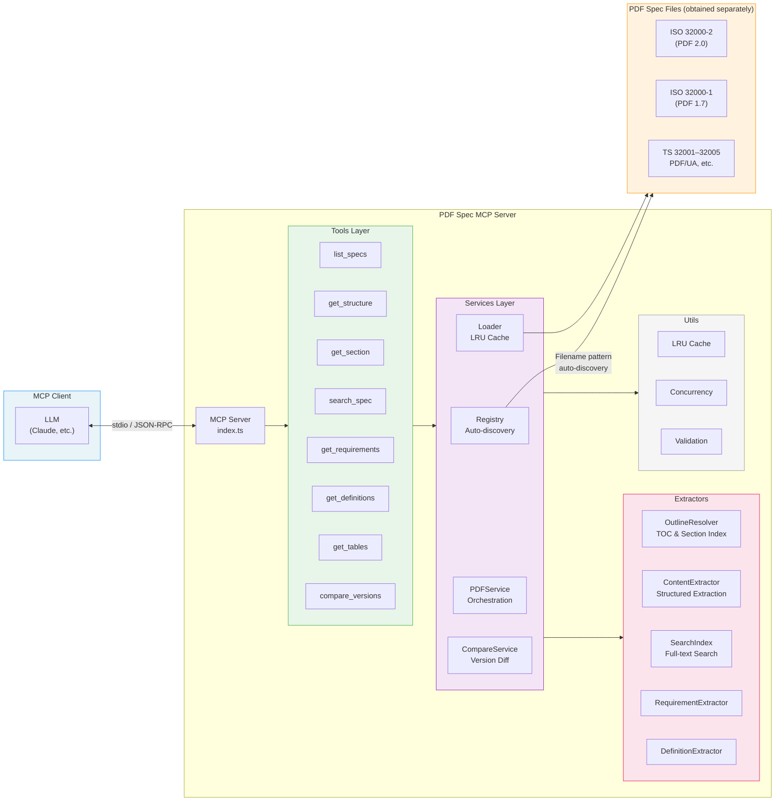

# PDF SPEC MCP Server

[](https://github.com/shuji-bonji/pdf-spec-mcp/actions/workflows/ci.yml)
[](https://www.npmjs.com/package/@shuji-bonji/pdf-spec-mcp)

[日本語版 README はこちら](README.ja.md)

An MCP (Model Context Protocol) server that provides structured access to ISO 32000 (PDF) specification documents. Enables LLMs to navigate, search, and analyze PDF specifications through well-defined tools.

> [!IMPORTANT]
> **PDF specification files are NOT included in this package.**
> You must obtain the PDF specification documents separately and place them in a local directory.
>
> **Download from:** [PDF Association — Sponsored Standards](https://pdfa.org/sponsored-standards/)
>
> See "[Setup](#setup)" for details.

## Features

- **Multi-spec support** — Auto-discovers and manages up to 17 PDF-related documents (ISO 32000-2, PDF/UA, Tagged PDF guides, etc.)
- **Structured content extraction** — Headings, paragraphs, lists, tables, and notes from any section
- **Full-text search** — Keyword search with section-aware context snippets
- **Requirements extraction** — Extracts normative language (shall / must / may) per ISO conventions
- **Definitions lookup** — Term definitions from Section 3 (Definitions)
- **Table extraction** — Multi-page table detection with header merging
- **Version comparison** — Diff PDF 1.7 vs PDF 2.0 section structures
- **Bounded-concurrency processing** — Parallel page processing for large documents

## Architecture



### Layer Overview

| Layer          | Responsibility                                                                     |
| -------------- | ---------------------------------------------------------------------------------- |
| **Tools**      | MCP tool schema definitions & handlers (input validation)                          |
| **Services**   | Business logic (PDF registry, loader, orchestration)                               |
| **Extractors** | Information extraction from PDFs (TOC, content, search, requirements, definitions) |
| **Utils**      | Shared utilities (cache, concurrency, validation)                                  |

## Setup

### 1. Obtain PDF Specification Files

> [!WARNING]
> PDF specifications are **copyrighted documents** and are not included in this package.
> Download them from the sources below and place them in a local directory.

| Document                     | Source                                                                                          |
| ---------------------------- | ----------------------------------------------------------------------------------------------- |
| ISO 32000-2 (PDF 2.0)        | [PDF Association](https://pdfa.org/resource/iso-32000-pdf/)                                     |
| ISO 32000-1 (PDF 1.7)        | [Adobe (free)](https://opensource.adobe.com/dc-acrobat-sdk-docs/pdfstandards/PDF32000_2008.pdf) |
| TS 32001–32005, PDF/UA, etc. | [PDF Association — Sponsored Standards](https://pdfa.org/sponsored-standards/)                  |

All 17 files below are supported. You do not need all of them — place only the specs you need (at minimum, ISO 32000-2 is recommended).

```
pdf-specs/
│
│ ── Standards ─────────────────────────────
├── ISO_32000-2_sponsored-ec2.pdf          # iso32000-2  : PDF 2.0 EC2 (recommended)
├── ISO_32000-2-2020_sponsored.pdf         # iso32000-2-2020 : PDF 2.0 original
├── PDF32000_2008.pdf                      # pdf17       : PDF 1.7 (for version comparison)
├── pdfreference1.7old.pdf                 # pdf17old    : Adobe PDF Reference 1.7
│
│ ── Technical Specifications (TS) ─────────
├── ISO_TS_32001-2022_sponsored.pdf        # ts32001     : Hash extensions (SHA-3)
├── ISO_TS_32002-2022_sponsored.pdf        # ts32002     : Digital signature extensions (ECC/PAdES)
├── ISO_TS_32003-2023_sponsored.pdf        # ts32003     : AES-GCM encryption
├── ISO-TS-32004-2024_sponsored.pdf        # ts32004     : Integrity protection
├── ISO-TS-32005-2023-sponsored.pdf        # ts32005     : Namespace mapping
│
│ ── PDF/UA (Accessibility) ────────────────
├── ISO-14289-1-2014-sponsored.pdf         # pdfua1      : PDF/UA-1
├── ISO-14289-2-2024-sponsored.pdf         # pdfua2      : PDF/UA-2
│
│ ── Guides ────────────────────────────────
├── Tagged-PDF-Best-Practice-Guide.pdf     # tagged-bpg  : Tagged PDF Best Practice
├── Well-Tagged-PDF-WTPDF-1.0.pdf          # wtpdf       : Well-Tagged PDF
├── PDF-Declarations.pdf                   # declarations: PDF Declarations
│
│ ── Application Notes ─────────────────────
├── PDF20_AN001-BPC.pdf                    # an001       : Black Point Compensation
├── PDF20_AN002-AF.pdf                     # an002       : Associated Files
└── PDF20_AN003-ObjectMetadataLocations.pdf # an003      : Object Metadata
```

### 2. Install

```bash
npm install @shuji-bonji/pdf-spec-mcp
```

Or run directly with npx:

```bash
PDF_SPEC_DIR=/path/to/pdf-specs npx @shuji-bonji/pdf-spec-mcp
```

### 3. Configure MCP Client

#### Environment Variable

| Variable       | Description                                  | Default    |
| -------------- | -------------------------------------------- | ---------- |
| `PDF_SPEC_DIR` | Directory containing PDF specification files | (required) |

#### Claude Desktop

Add to `claude_desktop_config.json`:

```json
{
  "mcpServers": {
    "pdf-spec": {
      "command": "npx",
      "args": ["-y", "@shuji-bonji/pdf-spec-mcp"],
      "env": {
        "PDF_SPEC_DIR": "/path/to/pdf-specs"
      }
    }
  }
}
```

#### Cursor / VS Code

Add to `.cursor/mcp.json` or VS Code MCP settings:

```json
{
  "mcpServers": {
    "pdf-spec": {
      "command": "npx",
      "args": ["-y", "@shuji-bonji/pdf-spec-mcp"],
      "env": {
        "PDF_SPEC_DIR": "/path/to/pdf-specs"
      }
    }
  }
}
```

## Available Tools

All tools accept an optional `spec` parameter to target a specific specification (default: `iso32000-2`).

| Tool               | Description                                                       |
| ------------------ | ----------------------------------------------------------------- |
| `list_specs`       | List all discovered PDF specifications with metadata              |
| `get_structure`    | Get section hierarchy (table of contents) with configurable depth |
| `get_section`      | Get structured content of a specific section                      |
| `search_spec`      | Full-text keyword search across a specification                   |
| `get_requirements` | Extract normative requirements (shall/must/may)                   |
| `get_definitions`  | Lookup term definitions                                           |
| `get_tables`       | Extract table structures from a section                           |
| `compare_versions` | Compare PDF 1.7 and PDF 2.0 section structures                    |

### `list_specs` — Discover Specifications

List all available specification documents. Use the returned IDs as the `spec` parameter in other tools.

```jsonc
// List all specs
{ }

// Filter by category
{ "category": "ts" }        // Technical specs only
{ "category": "pdfua" }     // PDF/UA only
{ "category": "guide" }     // Guide documents only
```

### `get_structure` — Table of Contents

Get the section hierarchy (TOC tree) of a specification.

```jsonc
// PDF 2.0 top-level sections only
{ "max_depth": 1 }

// Expand to 2 levels
{ "max_depth": 2 }

// TS 32002 (Digital Signatures) full structure
{ "spec": "ts32002" }

// PDF/UA-2 structure
{ "spec": "pdfua2", "max_depth": 2 }
```

### `get_section` — Section Content

Get structured content (headings, paragraphs, lists, tables, notes) of a specific section.

```jsonc
// PDF 2.0 Section 7.3.4 (String Objects)
{ "section": "7.3.4" }

// PDF 2.0 Annex A
{ "section": "Annex A" }

// TS 32002 Section 5
{ "spec": "ts32002", "section": "5" }

// PDF/UA-2 Section 8 (Tagged PDF)
{ "spec": "pdfua2", "section": "8" }
```

### `search_spec` — Full-text Search

Search across a specification with section-aware context snippets.

```jsonc
// Search PDF 2.0 for "digital signature"
{ "query": "digital signature" }

// Limit results
{ "query": "font", "max_results": 5 }

// Search within TS 32002
{ "spec": "ts32002", "query": "CMS" }
```

### `get_requirements` — Normative Requirements

Extract normative requirements (shall / must / may) per ISO conventions.

```jsonc
// All requirements in section 12.8
{ "section": "12.8" }

// Only "shall" requirements
{ "section": "12.8", "level": "shall" }

// Only "shall not" requirements
{ "section": "7.3", "level": "shall not" }

// PDF/UA-2 requirements
{ "spec": "pdfua2", "section": "8", "level": "shall" }
```

### `get_definitions` — Term Definitions

Look up term definitions from Section 3 (Definitions).

```jsonc
// Search for "font" definitions
{ "term": "font" }

// List all definitions
{ }

// PDF/UA definitions
{ "spec": "pdfua2", "term": "artifact" }
```

### `get_tables` — Table Extraction

Extract table structures (headers, rows, captions) from a section. Multi-page tables are automatically merged.

```jsonc
// All tables in section 7.3.4
{ "section": "7.3.4" }

// Specific table only (0-based index)
{ "section": "7.3.4", "table_index": 0 }

// TS spec tables
{ "spec": "ts32002", "section": "5" }
```

### `compare_versions` — Version Comparison

Compare section structures between PDF 1.7 (ISO 32000-1) and PDF 2.0 (ISO 32000-2). Uses title-based automatic matching to detect matched, added, and removed sections.

> [!NOTE]
> This tool requires both PDF 1.7 (`PDF32000_2008.pdf`) and PDF 2.0 files in `PDF_SPEC_DIR`.

```jsonc
// Diff section 12.8 (Digital Signatures)
{ "section": "12.8" }

// Compare all top-level sections
{ }
```

## Supported Specifications

The server auto-discovers PDF files in `PDF_SPEC_DIR` by filename pattern matching:

| Category           | Spec IDs                                             | Documents                                               |
| ------------------ | ---------------------------------------------------- | ------------------------------------------------------- |
| **Standard**       | `iso32000-2`, `iso32000-2-2020`, `pdf17`, `pdf17old` | ISO 32000-2 (PDF 2.0), ISO 32000-1 (PDF 1.7)            |
| **Technical Spec** | `ts32001` – `ts32005`                                | Hash, Digital Signatures, AES-GCM, Integrity, Namespace |
| **PDF/UA**         | `pdfua1`, `pdfua2`                                   | Accessibility (ISO 14289-1, 14289-2)                    |
| **Guide**          | `tagged-bpg`, `wtpdf`, `declarations`                | Tagged PDF, Well-Tagged PDF, Declarations               |
| **App Note**       | `an001` – `an003`                                    | BPC, Associated Files, Object Metadata                  |

## Directory Structure

```
src/
├── index.ts              # MCP server entry point
├── config.ts             # Configuration & spec patterns
├── errors.ts             # Error hierarchy (PDFSpecError → sub-classes)
├── container.ts          # Service container (DI wiring)
├── services/
│   ├── pdf-registry.ts       # Auto-discovery of PDF files
│   ├── pdf-loader.ts         # PDF loading with LRU cache
│   ├── pdf-service.ts        # Orchestration layer
│   ├── compare-service.ts    # Version comparison
│   ├── outline-resolver.ts   # Section index builder
│   ├── content-extractor.ts  # Structured content extraction
│   ├── search-index.ts       # Full-text search index
│   ├── requirement-extractor.ts
│   └── definition-extractor.ts
├── tools/
│   ├── definitions.ts    # MCP tool schemas
│   └── handlers.ts       # Tool implementations
└── utils/
    ├── concurrency.ts    # mapConcurrent (bounded Promise.all)
    ├── text.ts           # Text normalization
    ├── cache.ts          # LRU cache
    ├── validation.ts     # Input validation
    └── logger.ts         # Structured logger
```

## Development

```bash
git clone https://github.com/shuji-bonji/pdf-spec-mcp.git
cd pdf-spec-mcp
npm install
npm run build

# Unit tests (237 tests)
npm run test

# E2E tests (212 tests — requires PDF files in ./pdf-spec/)
npm run test:e2e

# Lint & format
npm run lint
npm run format:check
```

## License

[MIT](LICENSE)
