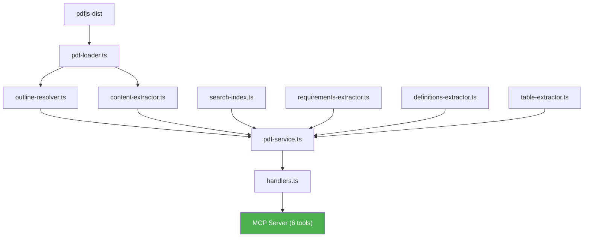
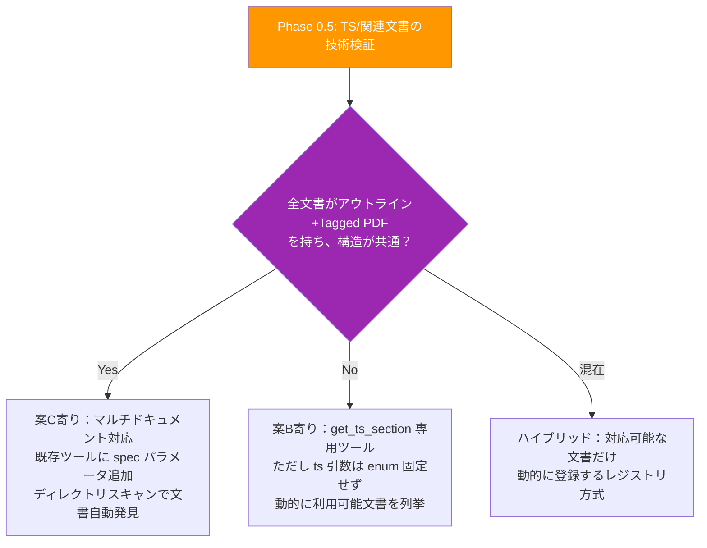

Phase 3 の設計に入る前に、現状を整理し、技術的課題を洗い出しましょう。

## Phase 3 の現状整理

### ロードマップ上の定義（企画定義書より）

| ツール                       | 説明                                  | UC         |
| ---------------------------- | ------------------------------------- | ---------- |
| `compare_versions`           | PDF 1.7 ↔ 2.0 の差分取得              | UC-4       |
| `get_ts_section`             | TS 32001/32002/32003 のセクション参照 | UC-3, UC-8 |
| 電子署名関連セクションの強化 | 12.8 + PAdES 拡張の統合参照           | UC-3, UC-8 |

### Phase 1/2 で確立済みの基盤

Phase 0〜2 で以下が動作しています。



**現在は ISO 32000-2 EC2 の単一PDF** のみを対象としています。

## Phase 3 に入る前に検討すべき課題

Phase 3 は Phase 1/2 と質的に異なります。単一PDFの内部処理から**複数PDF横断**へのアーキテクチャ拡張が必要です。

### 課題 1: 複数PDFの管理アーキテクチャ

現在 `pdf-service.ts` は `ISO_32000-2_sponsored-ec2.pdf` の1ファイル前提です。Phase 3 では最大 4 ファイルを扱う必要があります。

| ファイル                          | ページ数 | 用途             |
| --------------------------------- | -------- | ---------------- |
| `ISO_32000-2_sponsored-ec2.pdf`   | 1,020    | メイン (PDF 2.0) |
| `PDF32000_2008.pdf`               | 756      | 比較元 (PDF 1.7) |
| `ISO_TS_32002-2022_sponsored.pdf` | 13       | 電子署名拡張     |
| `ISO_TS_32001-2022_sponsored.pdf` | 13       | ハッシュ拡張     |
| `ISO_TS_32003-2023_sponsored.pdf` | 13       | AES-GCM 暗号化   |

**設計判断**: PDFレジストリ / マルチドキュメント管理をどう実現するか？

### 課題 2: TS 文書の構造解析可能性（未検証）

Phase 0 で検証したのは ISO 32000-2 EC2 のみです。TS 文書（13ページ前後）について以下が不明です。

- Tagged PDF 構造を持つか？（`getStructTree()` が機能するか）
- アウトライン（目次）が存在するか？
- セクション番号体系はISO 32000-2 と同じフォーマットか？

**→ Phase 3 にも Phase 0 的な技術検証が必要**

### 課題 3: `compare_versions` のセクションマッピング

PDF 1.7（ISO 32000-1）と PDF 2.0（ISO 32000-2）ではセクション番号体系が異なります。

```
例: 電子署名
  PDF 1.7: 8.7 "Digital Signatures"
  PDF 2.0: 12.8 "Digital Signatures"
```

**設計判断**: セクション対応をどう解決するか？

- A) 手動マッピングテーブル（主要セクションのみ）
- B) タイトルベースの自動マッチング
- C) キーワード検索ベースで「同じ機能」のセクションを発見

### 課題 4: 電子署名「強化」のスコープ定義

「電子署名関連セクションの強化」は抽象的です。具体的に何を実現するか定義が必要です。

考えられる方向性：

- ISO 32000-2 の 12.8 + TS 32002 の統合ビュー？
- 署名検証フローの構造化抽出？
- PAdES プロファイル（B-B, B-T, B-LT, B-LTA）の要件一覧？

---

Phase 3 の設計を進めるにあたって、いくつか方向性を決めたいポイントがあります。上記の3つの質問への回答をいただければ、それに基づいて Phase 3 の設計文書を作成します。

特に1つ目の優先順位が重要で、Phase 3 は Phase 1/2 と違って「未検証の領域」（TS 文書の構造、PDF 1.7 のアウトライン構造など）を含むため、設計→検証→再設計のサイクルが必要になる可能性があります。

その視点は重要です。実際、Phase 0 の調査時点で既にTSは **5つ** 確認されています。

| TS       | 内容                     | 企画定義書のスコープ |
| -------- | ------------------------ | -------------------- |
| TS 32001 | ハッシュアルゴリズム拡張 | ✅ Phase 3           |
| TS 32002 | 電子署名拡張（PAdES）    | ✅ Phase 3           |
| TS 32003 | AES-GCM 暗号化           | ✅ Phase 3           |
| TS 32004 | 整合性保護               | ❌ スコープ外        |
| TS 32005 | PDF/UA マッピング        | ❌ スコープ外        |

さらに PDF/UA（ISO 14289-1, 14289-2）やベストプラクティスガイドも `PDF_SPEC_DIR` に配置されうる文書です。

つまり先ほどの案で `enum: ['32001', '32002', '32003']` と固定したのは**短期的すぎる**設計でした。

---

## Phase 0.5 → 再検討で見極めるべきこと

Phase 0.5 では TS 3文書だけでなく、**TS 32004/32005 や PDF/UA も含めて検証**し、その結果を踏まえて以下の分岐を判断するのが良いと思います。



**TS文書の構造が ISO 32000-2 と十分に共通なら**、専用ツールを作るより既存ツール群を汎用化する方が筋が良い。逆に構造が大きく異なるなら分離する理由がある。

Phase 0.5 の結果が出てから、`get_ts_section` の最終設計を固めましょう。
