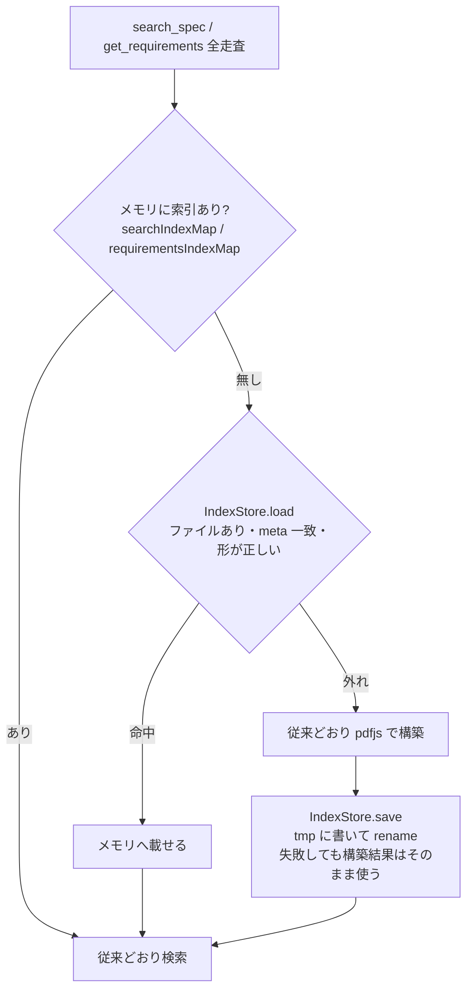

# Issue #6: 索引の永続化（IndexStore）実装計画

> Status: ✅ 0.5.0 として 2026-08-25 に公開・npx 検証 PASS・Issue #6 クローズ。§8 に実測結果
> 対象: [Issue #6](https://github.com/shuji-bonji/pdf-spec-mcp/issues/6) / 起点バージョン 0.4.6 / 目標バージョン 0.5.0

## Context

Issue #6 は「初回起動時に `PDF_SPEC_DIR` の PDF を全解析して SQLite に永続化する」提案だった。
検討の結果（2026-08-25）、方針を次のように確定した。

| Issue の原案 | 確定した方針 | 理由 |
|---|---|---|
| 初回**起動時**に全仕様を解析 | **初回利用時**に構築し、結果をディスクに保存する。全仕様の事前構築は CLI `--build-cache` として別に用意する | 起動時一括は触らない仕様の分まで毎回払う。pdfjs の `PagesMapper` の都合で仕様間は直列にしか回せない |
| SQLite + FTS5 | **JSON ファイル**。検索エンジンは置き換えない | 保存対象は `{page, section, text}[]`（大型仕様で 3〜5 MB）。読込は数十 ms で、既存の線形走査（28 ms）を置き換える理由が無い。FTS5 はトークン一致なので `searchTextIndex` の部分文字列一致・ハイフン正規化と結果が変わる。`engines: node >= 20` では `node:sqlite` が無く、better-sqlite3 のネイティブ依存が増える |
| Docker プリロード | **やらない** | 抽出済みテキストをイメージに含めると ISO 本文の再配布になる。ローカルキャッシュは利用者が自分で入手した PDF から利用者の機械上に作る派生物なので、いまのメモリ上の索引と同じ立場 |

RAG 化は本計画の範囲外（別途。適用先は houki-nta-mcp が先）。ただし保存レコードは文書順の
`{page, section, text}` なので、後から段落 ID を導出できる形にしておく（§7）。

### 何が遅いか（実測。`tests/e2e/baseline.json` 2026-07-19）

| 操作 | コールド | キャッシュ後 | 永続化の対象 |
|---|---|---|---|
| registry 初期化 | 1 ms | — | しない |
| get_structure | 139 ms | 0 ms | しない |
| get_section | 273 ms | 0 ms | しない |
| **search_spec** | **5,917 ms** | 28 ms | **する（Phase 1）** |
| get_requirements（section 指定） | 455 ms | — | しない |
| get_requirements（section 無し＝全走査） | **未計測**（"may take a while"） | — | **する（Phase 2）** |
| get_definitions | 61 ms | — | しない |

永続化で回収できるのは search_spec の索引構築と get_requirements の全走査の 2 つだけ。
どちらもプロセスごとに払うので、Claude Code がセッションごとにサーバを起動する運用では
「セッション数 × 触った仕様数」の回数を払っている。

## 1. 設計

### 1.1 動作



- 命中時は `reloadDocument` を呼ばない（pdfjs の再ロードと `PagesMapper` のリセットが不要になる）。
  ただし `getSectionIndex` は従来どおり呼ぶ（検索結果のタイトル解決に `sectionIndex.sections` が要る）。
- 外れの理由がどれであっても（ファイル無し・JSON が読めない・meta 不一致・形が違う）
  **同じ経路で再構築する**。キャッシュ起因でツールが失敗する経路は作らない。
- 書き込み失敗（EROFS / EACCES / ENOSPC）は `logger.warn` して続行。プロセス内で 1 度だけ警告する。

### 1.2 キャッシュキー（無効化条件）

ファイルの meta に次を持ち、**すべて一致したときだけ命中**とする。

| 項目 | 値 | 何を検知するか |
|---|---|---|
| `schemaVersion` | `INDEX_SCHEMA_VERSION`（config.ts の定数。初期値 1） | 保存形式の変更 |
| `packageVersion` | `PACKAGE_INFO.version` | 抽出ロジックの変更（リリース単位） |
| `pdfjsVersion` | `pdfjs-dist` の `version` | テキスト抽出結果の変更。`package.json` は `^5.4.624` だが手元の `node_modules` は 5.7.284 で、**同じ package 版でも install 時期で pdfjs の版が変わる**。packageVersion だけでは足りない |
| `specId` | 登録 ID | 同一ファイルが別 ID で登録された場合の区別（EC3 / EC2） |
| `fileSha256` | PDF 全体の SHA-256 | PDF の差し替え |
| `fileSize` | バイト数 | 早期判定（ハッシュ前に落とせる） |
| `kind` | `search` / `requirements` | 種別 |

**packageVersion をキーに含めるのが最重要。** 0.4.2（S-8）、0.4.3（S-9 / S-10）、0.4.5（#11）は
どれも索引の切り方を変えた修正だった。ファイルハッシュだけで判定すると、版を上げても古い切り方の
索引を読み続け、直したはずの不具合が再現する。症状は「検索結果が少し違う」だけなので気づけない。

SHA-256 は 32 MB のファイルで 100 ms 程度。構築（6 秒）に対して無視できる。
プロセス内で spec ごとに 1 回だけ計算してメモ化する。パスではなく内容で鍵を取るので、
`PDF_SPEC_DIR` が環境ごとに違っても同じ PDF なら同じキャッシュが使える。

### 1.3 置き場所とファイル名

```
${PDF_SPEC_CACHE_DIR:-${XDG_CACHE_HOME:-~/.cache}/pdf-spec-mcp}/
  v1/                                  ← schemaVersion
    0.5.0/                             ← packageVersion（版ごとに分離。plugin 版と local 版が同時に動いても衝突しない）
      iso32000-2.search.3f9a1c2e7b0d4a51.json     ← <specId>.<kind>.<sha256 先頭16桁>.json
      iso32000-2.requirements.3f9a1c2e7b0d4a51.json
      pdf17.search.….json
```

- ディレクトリでも版を分けるが、**meta の照合は必ず行う**（ディレクトリ名は人が消しやすくするための整理）。
- houki-nta-mcp と同じ `XDG_CACHE_HOME` 規約に揃える。
- `PDF_SPEC_DIR` の中には書かない（Docker ボリュームで読み取り専用のことがある）。
- `PDF_SPEC_CACHE=off` で無効化（読まない・書かない）。テストと読み取り専用環境用。

### 1.4 ファイル形式

```jsonc
{
  "meta": {
    "schemaVersion": 1,
    "packageVersion": "0.5.0",
    "pdfjsVersion": "5.7.284",
    "specId": "iso32000-2",
    "kind": "search",
    "fileSha256": "3f9a1c2e…",
    "fileSize": 19203156,
    "builtAt": "2026-08-25T03:00:00.000Z",
    "buildTimeMs": 5917
  },
  "data": { "pages": [ { "page": 1, "section": "", "text": "…" }, … ] }   // TextIndex.pages
}
```

`requirements` の `data` は `Requirement[]`。どちらも既存の型をそのまま直列化する（新しい型は作らない）。
`TextIndex.buildTime` は読込時に「読込にかかった ms」を入れる（ツール応答には出ていない内部値）。

### 1.5 原子的な書き込み

`<final>.tmp-<pid>-<random>` に `writeFile` → `rename`。`mkdir -p` は保存時に行う。
2 プロセスが同時に外れて同時に構築しても、同じ版・同じファイルなら内容は同じなので後勝ちで問題ない。
読込側は rename 後のファイルしか見ないので途中状態を読まない。

### 1.6 CLI

```
pdf-spec-mcp --build-cache [--spec=<id>[,<id>…]] [--force]
pdf-spec-mcp --clear-cache
pdf-spec-mcp --cache-info
```

| フラグ | 動作 |
|---|---|
| `--build-cache` | 登録済みの全仕様（`--spec` で絞れる）について search と requirements の索引を**直列に**構築して保存し、終了する。命中済みの仕様は飛ばす（`--force` で作り直す）。仕様ごとの所要 ms とファイルサイズを stderr に表で出す |
| `--clear-cache` | キャッシュディレクトリ配下を全部消す（全 schemaVersion・全 packageVersion） |
| `--cache-info` | ディレクトリ・有効/無効・仕様ごとの命中状況（あり / 無し / 版不一致）を表示する |

- MCP のツールにはしない（LLM が呼ぶ操作ではない。cron に載せる運用は houki-nta-mcp の
  `--bulk-download-everything` と同じ形になる）。
- 直列である理由: `pdf-loader.ts` の `PagesMapper` の説明どおり、全ページ走査は
  「最後に `getDocument()` した文書」のページ数に縛られる。仕様をまたいで並列にすると
  "Invalid page request" になる。
- フラグが無ければ従来どおり stdio サーバとして起動する（`index.ts` の分岐のみ。`server.ts` は触らない）。
- 出力は stderr（`stdout-guard` が最初の import なので `console.log` も stderr に行く）。終了コードは
  1 仕様でも構築に失敗したら 1。

## 2. ファイル変更サマリー

```
src/
  config.ts                     ← 修正: INDEX_SCHEMA_VERSION / CACHE_ENV（PDF_SPEC_CACHE_DIR, PDF_SPEC_CACHE）/ pdfjs 版の取得
  index.ts                      ← 修正: argv 分岐（--build-cache / --clear-cache / --cache-info）→ cli.ts へ
  cli.ts                        ← 新規: CLI 本体（registry 初期化 → 仕様ごとに直列で構築 → 表を出力）
  services/
    index-store.ts              ← 新規: IndexStore（resolveDir / load / save / clear / describe）+ NullIndexStore
    index-store.test.ts         ← 新規
    pdf-service.ts              ← 修正: コンストラクタ第 3 引数 store（省略時 defaultIndexStore）。searchSpec と buildRequirementsIndex に load/save を挟む
    pdf-service.test.ts         ← 修正: 偽 store を注入する describe を追加
    pdf-loader.ts                  (変更なし)
    search-index.ts                (変更なし — buildSearchIndex の出力をそのまま保存する)
    requirement-extractor.ts       (変更なし)
  tools/
    definitions.ts              ← 修正: search_spec の説明文（"cached on disk after the first build"）
    handlers.ts                    (変更なし — Phase 1 ではツール応答の形を変えない)
  utils/
    file-hash.ts                ← 新規: sha256 ストリーム計算（spec ごとにメモ化）
tests/e2e/
  setup.ts                      ← 修正: PDF_SPEC_CACHE_DIR を実行ごとの一時ディレクトリに向ける（コールド計測を守る・利用者の ~/.cache を汚さない）
  11-performance.test.ts        ← 修正: P-12（get_requirements 全走査コールド）を追加
  12-index-store.test.ts        ← 新規: 保存 → 別インスタンスで読込 → deep equal、無効化 3 条件、破損時の再構築
docs/
  issue6-index-store-plan.md    ← 本書
README.md / README.ja.md        ← 修正: 環境変数 2 つ・CLI 3 フラグ・置き場所・消し方
CHANGELOG.md                    ← 修正: [Unreleased]
CLAUDE.md                       ← 修正: 落とし穴 7（キーに版を含める理由・開発中の stale）
```

`registry.test.ts`（プロトコル越しの外部仕様スナップショット）は **Phase 1〜3 で変えない**。
ツールの入出力の形は変わらないため。

## 3. 実装ステップ

### Phase 0: 計測（実装前）

目的: Phase 2 と CLI の所要時間を、推定ではなく実測で持つ。

1. `11-performance.test.ts` に **P-12: get_requirements（section 無し・コールド）** を追加して
   `baseline.json` に記録する。現状この値は無い。
2. 全 17 仕様の search 索引を直列に構築したときの合計時間と、JSON 化したときの
   ファイルサイズ（大型 3 本: iso32000-2 / pdf17 / pdf17old）を一度測る（使い捨てスクリプトで可）。
   → README に書く「`--build-cache` の目安時間」と「ディスク使用量」の根拠にする。
3. P-12 が 10 秒未満なら requirements の永続化（Phase 2）は後回しにしてよい。
   10 秒を超えるなら Phase 2 を Phase 1 と同じリリースに入れる。

### Phase 1: IndexStore + search 索引の永続化

**対象**: `config.ts` / `utils/file-hash.ts` / `services/index-store.ts` / `services/pdf-service.ts`

1. `config.ts`
   ```typescript
   export const INDEX_SCHEMA_VERSION = 1;
   export const CACHE_ENV = { dir: 'PDF_SPEC_CACHE_DIR', toggle: 'PDF_SPEC_CACHE' } as const;
   ```
   pdfjs の版は `createRequire` で `pdfjs-dist/package.json` を読む（`PACKAGE_INFO` と同じ方法。
   pdfjs-dist の package.json に `exports` は無いので届く。legacy build も `version` を export
   しているが、型宣言が無いので pdf-loader.ts と同じキャストが要る。package.json 読みのほうが短い）。

2. `utils/file-hash.ts` — `sha256File(path): Promise<{ sha256: string; size: number }>`。
   `createReadStream` + `createHash('sha256')`。呼び出し側（IndexStore）がパスごとにメモ化する。

3. `services/index-store.ts`
   ```typescript
   export type IndexKind = 'search' | 'requirements';

   export interface IndexStore {
     load<T>(kind: IndexKind, specId: string, pdfPath: string): Promise<T | null>;
     save<T>(kind: IndexKind, specId: string, pdfPath: string, data: T, buildTimeMs: number): Promise<void>;
   }

   export class FileIndexStore implements IndexStore { /* §1.2〜1.5 */ }
   export class NullIndexStore implements IndexStore { /* load → null, save → 何もしない */ }

   /** PDF_SPEC_CACHE=off なら Null、そうでなければ File */
   export function createDefaultIndexStore(): IndexStore
   ```
   - `load` は **絶対に throw しない**。読めない・不一致・形違いは `null`。理由を `logger.debug`。
   - `save` も throw しない。失敗は `logger.warn`（プロセス内 1 回）。
   - 形の検査は最小限で固定する: `search` は `Array.isArray(data.pages)` と各要素の
     `page: number / section: string / text: string`、`requirements` は `Array.isArray(data)`。
     深い検証はしない（meta で版が一致していれば形は決まっている）。
   - ディレクトリ解決はコンストラクタではなく **最初の load/save 時**に行う
     （e2e の setup が環境変数を後から設定するため）。

4. `services/pdf-service.ts`
   - コンストラクタに第 3 引数 `store: IndexStore = createDefaultIndexStore()`。
   - `searchSpec`:
     ```typescript
     if (!searchIndexPromise) {
       searchIndexPromise = this.loadOrBuildSearchIndex(id, index);
       this.searchIndexMap.set(id, searchIndexPromise);
     }
     ```
     `loadOrBuildSearchIndex`: `store.load` → 命中なら `{ pages, buildTime: loadMs }` を返す。
     外れなら従来どおり `reloadDocument` → `buildSearchIndex` → `store.save`（await しない。
     失敗しても結果に影響しない）→ 返す。
   - **命中経路が `reloadDocument` を呼ばない**ことをユニットで固定する（loader の spy）。

5. `definitions.ts` の search_spec 説明文を
   "The first call may take a few seconds to build the search index (it is cached on disk
   afterwards)." に変える。

### Phase 2: requirements 全走査索引の永続化

**対象**: `services/pdf-service.ts` の `buildRequirementsIndex`

- Phase 1 と同じ形で `store.load('requirements', …)` → 外れなら従来の全走査 → `store.save`。
- section 指定の経路（455 ms）は触らない。
- 注意: 全走査は `getOwnSectionContent` を全セクションに対して呼び、`sectionContentCache`
  （LRU 50）を通る。命中経路はこれを一切呼ばないので、**命中後の get_section のコールド時間は
  変わらない**（従来も LRU が 50 件で溢れていたので実質同じ）。

### Phase 3: CLI

**対象**: `index.ts` / `cli.ts`

- `index.ts` は `process.argv.slice(2)` に `--build-cache` / `--clear-cache` / `--cache-info` /
  `--help` があれば `cli.ts` の `runCli(args)` を呼んで `process.exit(code)`。無ければ従来どおり。
- `runCli` は `ensureRegistryInitialized()` → `listSpecs()` の順（`SPEC_PATTERNS` の優先順）で
  `defaultPdfService` を使って **直列に** `searchSpec('a', 1, id)` と `getRequirements(undefined, undefined, id)`
  を呼ぶ（ツールと同じ経路を通すので、CLI 専用の構築コードを持たない。ツールと CLI で索引が
  食い違う経路を作らない）。
- 表の列: specId / search（hit・built ms・KB）/ requirements（hit・built ms・KB）。
- `--force` は store に `bypassLoad = true` を立ててから走らせる。

### Phase 4: ドキュメント・リリース・公開版検証

1. README（en / ja）: 環境変数 `PDF_SPEC_CACHE_DIR` / `PDF_SPEC_CACHE=off`、CLI 3 フラグ、
   置き場所、Phase 0 で測った所要時間とディスク使用量、消し方。
   「キャッシュは利用者の機械上の派生物であり、配布しない」を明記（Docker 節があれば
   「イメージに含めない」も）。
2. CHANGELOG `[Unreleased]` → `[0.5.0]`。
3. CLAUDE.md 落とし穴 7: 「キャッシュキーに packageVersion を含める理由」と
   「**開発中は版が変わらないので、抽出ロジックを直したら `--clear-cache` するか
   `PDF_SPEC_CACHE=off` で回す**。e2e は setup が一時ディレクトリに向けるので常にコールド」。
4. リリース手順は CLAUDE.md どおり。公開版検証は従来の「同じツールを複数回・順序を変えて」に
   加えて、**同じ隔離環境で 2 回目のプロセスを起動して search_spec が数百 ms で返ること**と、
   `~/.cache/pdf-spec-mcp/v1/0.5.0/` にファイルができていることを見る。

## 4. テスト

### 4.1 ユニット（`index-store.test.ts`、仕様 PDF 不要）

一時ディレクトリと小さなダミーファイル（PDF である必要はない。ハッシュ対象なだけ）で回す。

| # | 内容 | 落ちるように壊す方法 |
|---|---|---|
| IS-1 | save → load が deep equal | save を空実装にする |
| IS-2 | packageVersion 違い → null | meta 照合から packageVersion を外す |
| IS-3 | pdfjsVersion 違い → null | 同上 |
| IS-4 | schemaVersion 違い → null | 同上 |
| IS-5 | ファイル内容を 1 バイト変える → null | ハッシュを size だけにする |
| IS-6 | JSON を途中で切る → null、throw しない | try を外す |
| IS-7 | data の形が違う（`pages` が無い）→ null | 形検査を外す |
| IS-8 | 書けないディレクトリ → save が resolve し、warn が 1 回 | — |
| IS-9 | `PDF_SPEC_CACHE=off` → load null・ファイルが作られない | — |
| IS-10 | save 後に `.tmp-` が残らない | rename を copy にする |
| IS-11 | 同じキーへ同時に 2 回 save → 最終ファイルは valid な JSON | rename を writeFile 直書きにする |

### 4.2 ユニット（`pdf-service.test.ts` に追加、合成 PDF）

| # | 内容 |
|---|---|
| PS-C1 | 偽 store（Map）を共有する 2 つの `PDFSpecService` で searchSpec。2 つ目は loader の `reloadDocument` を **呼ばない**（spy）。結果は deep equal |
| PS-C2 | 同じく requirements 全走査（Phase 2） |
| PS-C3 | store.load が throw するよう細工しても searchSpec は成功する（store 側で握るので本来届かないが、service 側にも防御があることを固定） |
| PS-C4 | 命中した索引を消費側が変更しても、次の呼び出しの結果が変わらない（0.4.0 の再来防止。`searchTextIndex` は hits を新規に作るので現状問題ないが、テストで固定する） |

### 4.3 e2e（`12-index-store.test.ts`、実 PDF）

| # | 内容 | 基準 |
|---|---|---|
| C-1 | 一時ディレクトリを `PDF_SPEC_CACHE_DIR` にして search_spec → ファイルが 1 つできる | ファイル名が §1.3 の形 |
| C-2 | 新しい `PDFSpecService`（実 loader）で同じ 5 クエリを search_spec → 結果が C-1 と deep equal | 索引そのもの（`pages`）も deep equal |
| C-3 | C-2 の所要時間 | **< 500 ms**（コールド 5,917 ms に対して） |
| C-4 | ファイルの meta.packageVersion を書き換える → 再構築される（reloadDocument が呼ばれる） | — |
| C-5 | X-13〜X-15（冪等性）をキャッシュ有効で再実行 | 全緑 |
| C-6 | `--build-cache` を子プロセスで実行 → 17 仕様分のファイルが揃う。終了コード 0 | 2 回目は全部 hit で数秒 |

### 4.4 既存テストへの影響

- `11-performance` の P-6（search コールド）は、setup が一時ディレクトリに向けるので
  **引き続きコールドを測る**。これを怠ると 2 回目以降の CI が構築時間を測らなくなる。
- `registry.test.ts`: 変更なし（外部仕様は不変）。
- サンドボックスの制約（CLAUDE.md）: `npm install` しない。依存は増えない（`node:crypto` /
  `node:fs` / `node:os` のみ）。typecheck / `check:imports` はサンドボックスで、
  test / e2e / biome はホストか複製で回す。

## 5. 受け入れ基準

1. 同じ PDF・同じ版で、コールド構築した索引とキャッシュから読んだ索引が **deep equal**（C-2）。
2. `package.json` の版を変えると miss になり再構築される（IS-2 / C-4）。
3. PDF を差し替えると miss になる（IS-5）。
4. キャッシュファイルを壊しても、ツールは成功し再構築される（IS-6 / IS-7）。
5. 2 回目のプロセスの search_spec が 500 ms 未満（C-3）。
6. 全ツールの冪等性（X-13〜X-15）がキャッシュ有効でも緑（C-5）。
7. `registry.test.ts` のスナップショットが不変。
8. 依存パッケージが増えていない。
9. 公開版を npx で 2 プロセス叩き、2 回目が命中する（Phase 4-4）。

## 6. リスクと対処

| リスク | 対処 |
|---|---|
| 版を上げても古い索引を読む | meta に packageVersion / pdfjsVersion / schemaVersion（§1.2）。IS-2〜4 で固定 |
| 開発中（版が同じ）にロジックを直しても古い索引を読む | e2e は常に一時ディレクトリ。手動検証は `--clear-cache` か `PDF_SPEC_CACHE=off`。CLAUDE.md に書く |
| 読み取り専用環境で失敗する | save は warn して続行。load 失敗は再構築 |
| 2 プロセスが同時に書く | tmp → rename。内容は同一なので後勝ちで可 |
| 古い版のディレクトリが溜まる | `--clear-cache`。自動削除はしない（別版のプロセスが同時に動いている可能性がある） |
| キャッシュから読んだ配列を消費側が書き換える | 0.4.0 と同じ形の事故。PS-C4 / C-5 で固定 |
| `--build-cache` を並列化したくなる | しない。`PagesMapper` の制約（`pdf-loader.ts` のコメント） |

## 7. 範囲外（後続の判断材料として記録）

- **own-content（セクション分割片）の永続化**: get_section コールド 273 ms なので今は不要。
  RAG の chunk 源として文書モデルを丸ごと持ちたくなった時点で `kind: 'sections'` として足す。
  形式は同じ IndexStore に載る。
- **段落 ID**: `search` の `pages` は文書順で `(page, ページ内の順番)` から決定的に導出できる。
  RAG 側で `${specId}:${page}:${ordinal}` を付ければよく、いま保存形式に ID 列を足す必要は無い。
  形式を変えるときは `INDEX_SCHEMA_VERSION` を上げる。
- **ツール応答へのキャッシュ状態の露出**（`list_specs` に `indexed: boolean` など）:
  外部仕様が変わり `registry.test.ts` の更新が要る。必要になったら別 Issue。
- **gzip**: parse が数十 ms、ファイルが 20 MB 弱で済むので入れない。Phase 0 の実測で
  合計が 100 MB を超えるなら再検討。

## 8. 実施記録（2026-08-25）

### Phase 0 の実測（サンドボックス: Intel Xeon 2.80 GHz × 2 CPU。Mac は約 4〜5 倍速い）

`scripts/issue6-phase0-measure.ts`（使い捨て。ツールと同じ経路で直列に測る）。

| spec | pages | search 構築 | search JSON | requirements 全走査 | 件数 | requirements JSON |
|---|---:|---:|---:|---:|---:|---:|
| iso32000-2 | 1023 | 28,624 ms | 2,561 KB | 53,252 ms | 6,934 | 1,982 KB |
| iso32000-2-2020 | 1003 | 22,537 ms | 2,542 KB | 54,227 ms | 6,916 | 1,976 KB |
| pdf17 | 756 | 14,911 ms | 2,151 KB | 20,126 ms | 9,919 | 2,631 KB |
| pdf17old | 1310 | 21,046 ms | 2,727 KB | 24,046 ms | 1,623 | 465 KB |
| 残り 13 本 | 5〜72 | 86〜1,288 ms | 5〜138 KB | 0〜2,681 ms | 0〜306 | 0〜76 KB |
| **合計** | | **92.8 s** | | **162.6 s** | | **17.5 MB** |

- 同じ機械での P-6（search コールド）は 23.9 秒。Mac の baseline 5.9 秒との比は約 4 倍。
  → Mac 推定: 全仕様の `--build-cache` ≈ 1 分、requirements 全走査（iso32000-2）≈ 11 秒。
- **requirements 全走査は 10 秒（Mac 推定）を超えるので Phase 2 を同じリリースに入れた。**
- ディスク: 17.5 MB / 版。gzip は入れない（§7 の判断どおり）。
- P-12 を `11-performance` に追加（上限 60,000 ms = Mac 推定の約 5 倍）。

### 実装の差分（計画からの変更点）

- `IndexStore.load` の戻りを `{ data, meta, path, loadTimeMs }` にした（CLI の hit/built 表示と
  e2e の同一性検査に path が要る）。`save` は書いた path を返す。
- `FileIndexStore` に `clear()` / `entries()` / `describe()` / `pathFor()` を足した（CLI とテスト用。
  service が依存する `IndexStore` インターフェイスは load / save のみ）。
- ハッシュのメモ化キーは path ではなく `path|size|mtime`。同一プロセス内で PDF を差し替えても
  古いキーで命中しない（IS-5 が同一インスタンスで落ちて発覚）。
- `save` は「PDF を読めない」と「キャッシュ先に書けない」を分け、前者は warn しない
  （ユニットの偽パス `/fake/spec.pdf` で毎回 warn が出ていた）。
- service 側は `load` だけでなく `save` も try で包む（PS-C3 が save の throw で落ちて発覚）。
- e2e は setup.ts で既定 store を `PDF_SPEC_CACHE=off`、`12-index-store` が明示 store を注入。
  計画の「一時ディレクトリに向ける」より単純で、ワーカー再利用でも P-6 が構築を測る。
- `runCli(argv, out, env)` — env を注入できるので e2e C-6 は process.env を触らずに回る。

### 検査結果

| 検査 | 結果 |
|---|---|
| `npm test` | 339 / 339（17 ファイル。新規 index-store 24 + pdf-service PS-C1〜C4） |
| `npm run test:e2e` | 244 / 246。落ちた 2 件は環境起因: P-6（サンドボックスで 23 秒。変更前の baseline 計測でも同じ）と X-5（並走していた孤児ワーカーによる CPU 枯渇で timeout。単独再実行で 15/15 pass） |
| e2e 12-index-store（8 件） | iso32000-2: search 24,297 ms → **163 ms**、requirements 51,033 ms → **23 ms**。索引 deep equal |
| `npm run typecheck` / `typecheck:tests` | pass |
| `npm run check`（biome） | pass |
| `npm run check:imports` | pass |
| `registry.test.ts`（外部仕様スナップショット） | 不変（search_spec の説明文の 1 文だけ変更。スナップショット対象外） |
| 壊して落ちる | IS-2（キーから packageVersion を外す）/ IS-7・7b（形の検査を外す）/ PS-C1（service が cache を無視）/ IS-10・11（rename を直書きに）— それぞれ狙ったテストだけが落ちた |
| `--build-cache` 実走 | 3 仕様: 1 回目 2.7 s（built）→ 2 回目 0.2 s（hit）。`--cache-info` / `--clear-cache` / 未知 spec（exit 2）/ off（exit 2） |

### 残り（host 側）

1. `package.json` を 0.5.0 に上げる（`npm version minor` で plugin.json も同期）、CHANGELOG の
   `[Unreleased]` を `[0.5.0] - <日付>` に確定
2. `npm test` / `npm run test:e2e` / `npm run check` を Mac で回し、P-6 / P-12 の Mac の値を
   baseline.json に記録する（サンドボックスの値は書き戻していない）
3. コミット → push → `git tag v0.5.0`
4. 公開版を npx で隔離環境に落とし、**同じ環境で 2 プロセス**起動して 2 回目の `search_spec` が
   数百 ms で返ること、`~/.cache/pdf-spec-mcp/v1/0.5.0/` にファイルがあることを見る
5. Issue #6 をクローズ（方針の変更点を添えて）
