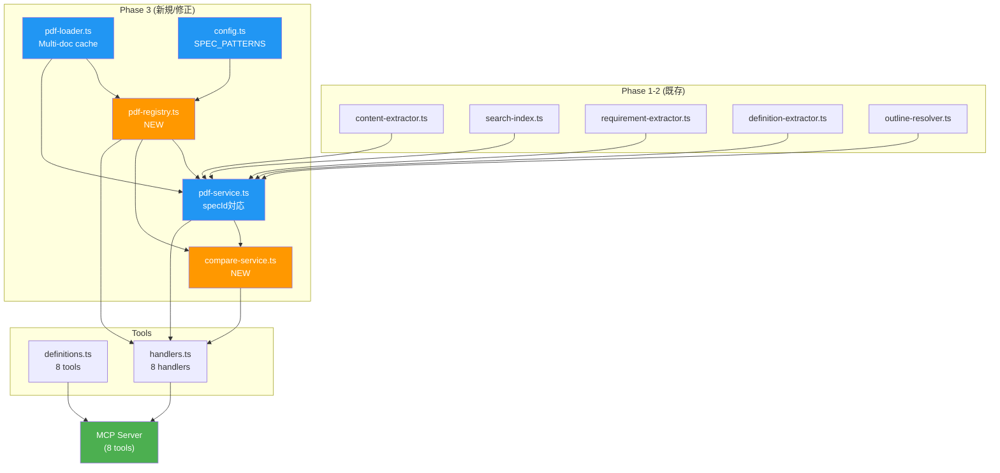

# Phase 3: マルチドキュメント対応 + バージョン比較 実装計画

> Status: 📝 計画中（レビュー反映 v2）

## Context

Phase 0.5 の技術調査により、`pdf-spec/` 内の全17 PDFがアウトライン + StructTree + テキスト抽出に対応していることを確認済み。Phase 3 では、単一PDF前提のアーキテクチャを**マルチドキュメント対応**に拡張し、2つの新ツール（`list_specs`, `compare_versions`）を追加する。

**設計方針: 案C（既存ツール汎用化）**

- 既存6ツールに `spec` パラメータを追加（省略時は ISO 32000-2 EC2 = 後方互換）
- 新ツール `list_specs` で利用可能文書を動的に列挙
- 新ツール `compare_versions` で PDF 1.7 ↔ 2.0 のセクション差分を取得

## ファイル変更サマリー

```
src/
  config.ts                   ← 修正: ドキュメントパターン定義追加
  types/
    index.ts                  ← 修正: Spec関連型、既存Args型にspec追加
  utils/
    validation.ts             ← 修正: validateSpecId追加
  services/
    pdf-loader.ts             ← 修正: マルチドキュメントキャッシュ化
    pdf-registry.ts           ← 新規: ドキュメントレジストリ + 自動発見
    compare-service.ts        ← 新規: バージョン比較ロジック
    pdf-service.ts            ← 修正: specId パラメータ対応、Map化
    outline-resolver.ts       ← 修正: parseSectionNumber拡張
    content-extractor.ts         (変更なし)
    search-index.ts              (変更なし)
    requirement-extractor.ts     (変更なし)
    definition-extractor.ts      (変更なし — pdf-service.ts 側でガード)
  tools/
    definitions.ts            ← 修正: 既存ツールにspec追加、新ツール追加
    handlers.ts               ← 修正: specId解決、新ハンドラー追加
  index.ts                       (変更なし — ツール非依存のディスパッチ)
```

## 実装ステップ

---

### Step 1: 型定義の拡張

**対象ファイル**: `src/types/index.ts`

新規追加:

```typescript
// ========================================
// Document Registry
// ========================================

/** Spec identifier (used as `spec` parameter in tools) */
export type SpecId = string;

/** Category of PDF document */
export type SpecCategory = 'standard' | 'ts' | 'pdfua' | 'guide' | 'appnote';

/** Registered PDF document metadata */
export interface SpecInfo {
  id: SpecId;
  title: string;
  filename: string;
  pages: number | null; // null until PDF is first opened
  category: SpecCategory;
  outlineEntries: number | null; // null until section index is built
  description: string;
}

/** list_specs result */
export interface ListSpecsResult {
  totalSpecs: number;
  specs: SpecInfo[];
}

export interface ListSpecsArgs {
  category?: string;
}

// ========================================
// Version Comparison
// ========================================

/** A matched section pair between two spec versions */
export interface SectionMapping {
  section17: string;
  section20: string;
  title: string;
  status: 'same' | 'moved' | 'renamed';
}

/** A section present in only one version */
export interface UnmatchedSection {
  section: string;
  title: string;
  version: 'pdf17' | 'pdf20';
}

/** compare_versions result */
export interface CompareVersionsResult {
  totalMatched: number;
  totalAdded: number; // PDF 2.0 にのみ存在
  totalRemoved: number; // PDF 1.7 にのみ存在
  matched: SectionMapping[];
  added: UnmatchedSection[];
  removed: UnmatchedSection[];
}

export interface CompareVersionsArgs {
  section?: string; // 特定セクションに絞る（省略時は全体比較）
}
```

既存の Args 型に `spec` を追加:

```typescript
export interface GetStructureArgs {
  spec?: string; // ← 追加
  max_depth?: number;
}

export interface GetSectionArgs {
  spec?: string; // ← 追加
  section: string;
}

export interface SearchSpecArgs {
  spec?: string; // ← 追加
  query: string;
  max_results?: number;
}

export interface GetRequirementsArgs {
  spec?: string; // ← 追加
  section?: string;
  level?: string;
}

export interface GetDefinitionsArgs {
  spec?: string; // ← 追加
  term?: string;
}

export interface GetTablesArgs {
  spec?: string; // ← 追加
  section: string;
  table_index?: number;
}
```

---

### Step 2: 設定ファイルの拡張

**対象ファイル**: `src/config.ts`

ファイル名パターン → specId のマッピングルールを定義。ディレクトリスキャン時にこのパターンでマッチングする。

```typescript
/** Filename pattern → spec ID mapping rule */
export interface SpecPattern {
  pattern: RegExp;
  id: string;
  title: string;
  category: SpecCategory;
  description: string;
}

export const SPEC_PATTERNS: SpecPattern[] = [
  // Primary: ISO 32000-2 EC2 (must be first — default spec)
  {
    pattern: /ISO_32000-2_sponsored-ec2\.pdf$/i,
    id: 'iso32000-2',
    title: 'ISO 32000-2:2020 (PDF 2.0) with Errata Collection 2',
    category: 'standard',
    description: 'The current PDF 2.0 specification with errata corrections',
  },
  // ISO 32000-2 original (no errata)
  {
    pattern: /ISO_32000-2-2020_sponsored\.pdf$/i,
    id: 'iso32000-2-2020',
    title: 'ISO 32000-2:2020 (PDF 2.0) original',
    category: 'standard',
    description: 'Original PDF 2.0 specification without errata',
  },
  // PDF 1.7 (ISO 32000-1)
  {
    pattern: /PDF32000_2008\.pdf$/i,
    id: 'pdf17',
    title: 'ISO 32000-1:2008 (PDF 1.7)',
    category: 'standard',
    description: 'The PDF 1.7 specification (first ISO-standardized version)',
  },
  // Adobe PDF Reference 1.7
  {
    pattern: /pdfreference1\.7old\.pdf$/i,
    id: 'pdf17old',
    title: 'PDF Reference 1.7 (Adobe)',
    category: 'standard',
    description: 'Adobe PDF Reference, version 1.7 (pre-ISO)',
  },
  // TS documents
  {
    pattern: /ISO_TS_32001.*\.pdf$/i,
    id: 'ts32001',
    title: 'ISO/TS 32001:2022',
    category: 'ts',
    description: 'Extensions to Hash Algorithms in ISO 32000-2 (SHA-3)',
  },
  {
    pattern: /ISO_TS_32002.*\.pdf$/i,
    id: 'ts32002',
    title: 'ISO/TS 32002:2022',
    category: 'ts',
    description: 'Extensions to Digital Signatures in ISO 32000-2 (ECC/PAdES)',
  },
  {
    pattern: /ISO_TS_32003.*\.pdf$/i,
    id: 'ts32003',
    title: 'ISO/TS 32003:2023',
    category: 'ts',
    description: 'Adding support of AES-GCM in PDF 2.0',
  },
  {
    pattern: /ISO[-_]TS[-_]32004.*\.pdf$/i,
    id: 'ts32004',
    title: 'ISO/TS 32004:2024',
    category: 'ts',
    description: 'Integrity protection in encrypted documents in PDF 2.0',
  },
  {
    pattern: /ISO[-_]TS[-_]32005.*\.pdf$/i,
    id: 'ts32005',
    title: 'ISO/TS 32005:2023',
    category: 'ts',
    description: 'PDF 1.7 and 2.0 structure namespace mapping',
  },
  // PDF/UA
  {
    pattern: /ISO[-_]14289[-_]1.*\.pdf$/i,
    id: 'pdfua1',
    title: 'ISO 14289-1:2014 (PDF/UA-1)',
    category: 'pdfua',
    description: 'PDF/UA-1: Accessibility using ISO 32000-1',
  },
  {
    pattern: /ISO[-_]14289[-_]2.*\.pdf$/i,
    id: 'pdfua2',
    title: 'ISO 14289-2:2024 (PDF/UA-2)',
    category: 'pdfua',
    description: 'PDF/UA-2: Accessibility using ISO 32000-2',
  },
  // PDF Association guides
  {
    pattern: /Tagged-PDF-Best-Practice/i,
    id: 'tagged-bpg',
    title: 'Tagged PDF Best Practice Guide: Syntax 1.0.1',
    category: 'guide',
    description: 'PDF Association guide for tagged PDF syntax',
  },
  {
    pattern: /Well-Tagged-PDF-WTPDF/i,
    id: 'wtpdf',
    title: 'Well-Tagged PDF (WTPDF) 1.0',
    category: 'guide',
    description: 'Using Tagged PDF for Accessibility and Reuse in PDF 2.0',
  },
  {
    pattern: /PDF-Declarations\.pdf$/i,
    id: 'declarations',
    title: 'PDF Declarations',
    category: 'guide',
    description: 'PDF Association specification for PDF Declarations',
  },
  // Application Notes
  {
    pattern: /PDF20_AN001/i,
    id: 'an001',
    title: 'PDF 2.0 Application Note 001',
    category: 'appnote',
    description: 'Black Point Compensation',
  },
  {
    pattern: /PDF20_AN002/i,
    id: 'an002',
    title: 'PDF 2.0 Application Note 002',
    category: 'appnote',
    description: 'Associated Files',
  },
  {
    pattern: /PDF20_AN003/i,
    id: 'an003',
    title: 'PDF 2.0 Application Note 003',
    category: 'appnote',
    description: 'Object Metadata Locations',
  },
];

export const DEFAULT_SPEC_ID = 'iso32000-2';
```

---

### Step 3: PDFレジストリの実装

**対象ファイル**: `src/services/pdf-registry.ts` (新規)

ディレクトリスキャンによるPDF自動発見と、specId → ファイルパスの解決を担当。

```typescript
/**
 * PDF Document Registry
 * Auto-discovers PDFs from PDF_SPEC_DIR and maps spec IDs to file paths
 */

// Public API:
export async function initRegistry(): Promise<void>;
export function getSpecPath(specId: string): string;
export function listSpecs(category?: SpecCategory): SpecInfo[];
export function isSpecAvailable(specId: string): boolean;
export function resolveSpecId(specIdOrDefault?: string): string;
```

**実装方針:**

- 初回アクセス時に `readdir(PDF_SPEC_DIR)` でスキャン
- `SPEC_PATTERNS` とマッチングし、見つかったPDFを登録
- マッチしないPDFファイルはスキップ（ログ出力のみ）
- 結果は `Map<SpecId, { path: string; info: SpecInfo }>` に保持

**初期化タイミングと `SpecInfo` フィールドの遅延取得:**

`list_specs` はファイルスキャンのみで即座に応答する必要がある。一方 `pages` と `outlineEntries` はPDFを開かないと取得できない。そこで二段階で情報を埋める:

1. **`discoverSpecs()`** — ファイルスキャンのみ（path + pattern match）
   - `pages: null`, `outlineEntries: null` のまま `SpecInfo` を登録
   - `list_specs` はこの段階で呼び出し可能
2. **`enrichSpecInfo(specId)`** — 初回ツール呼び出し時（`getSectionIndex()` 等）に自動実行
   - PDFを開いて `pages` を取得、インデックス構築後に `outlineEntries` を更新
   - 一度取得した値は `SpecInfo` に書き戻してキャッシュ

```typescript
// discoverSpecs() の出力例（list_specs 初回呼び出し時）
{ id: "ts32002", title: "ISO/TS 32002:2022", pages: null, outlineEntries: null, ... }

// enrichSpecInfo() 後（get_section({ spec: "ts32002", ... }) 後）
{ id: "ts32002", title: "ISO/TS 32002:2022", pages: 13, outlineEntries: 15, ... }
```

---

### Step 4: pdf-loader.ts のマルチドキュメント対応

**対象ファイル**: `src/services/pdf-loader.ts`

現在のキャッシュは単一スロット:

```typescript
// Before (single slot)
let cachedDoc: PDFDocumentProxy | null = null;
let cachedPath: string | null = null;
```

Map ベースのキャッシュに変更:

```typescript
// After (multi-document)
const documentCache = new Map<string, PDFDocumentProxy>();
```

**注意点:**

- PDFDocumentProxy はメモリを消費する（ISO 32000-2 EC2 で約17MB）
- 同時に全17ファイル（計100MB超）をキャッシュすると問題の可能性
- **対策**: LRU方式で最大4ドキュメントまでキャッシュ。溢れたら `doc.destroy()` で解放
- Phase 1-2 の使用パターン（単一PDF）は影響なし

**既存 `LRUCache` クラスを使わない理由:**

`src/utils/cache.ts` の `LRUCache<K, V>` はエビクション時にコールバックを持たない。`PDFDocumentProxy` はメモリ上に巨大なバイナリデータを保持しており、エビクション時に `doc.destroy()` を呼ばないとメモリリークする。`onEvict` コールバックを `LRUCache` に追加する案もあるが、Phase 3 では `pdf-loader.ts` 内にインラインで簡潔に実装する（Map + accessOrder 配列で約20行）。`LRUCache` への `onEvict` 拡張は必要に応じて Phase 4 で検討する。

```typescript
const MAX_CACHED_DOCS = 4;
const documentCache = new Map<string, PDFDocumentProxy>();
const accessOrder: string[] = []; // LRU tracking

export async function loadDocument(pdfPath: string): Promise<PDFDocumentProxy> {
  const existing = documentCache.get(pdfPath);
  if (existing) {
    // Move to end of access order (LRU)
    const idx = accessOrder.indexOf(pdfPath);
    if (idx >= 0) accessOrder.splice(idx, 1);
    accessOrder.push(pdfPath);
    return existing;
  }

  // Evict if full
  while (documentCache.size >= MAX_CACHED_DOCS && accessOrder.length > 0) {
    const oldest = accessOrder.shift()!;
    const doc = documentCache.get(oldest);
    if (doc) {
      doc.destroy();
      documentCache.delete(oldest);
    }
  }

  // Load new document
  const data = new Uint8Array(await readFile(pdfPath));
  const doc = await (pdfjsLib as any).getDocument({ data }).promise;
  documentCache.set(pdfPath, doc);
  accessOrder.push(pdfPath);
  return doc;
}
```

---

### Step 5: pdf-loader.ts の parseSectionNumber 拡張

**対象ファイル**: `src/services/pdf-loader.ts`（`parseSectionNumber` は L115 に定義）

WTPDF の `"1. Introduction"` 形式と `"Appendix A: ..."` 形式に対応:

```typescript
function parseSectionNumber(title: string): string | null {
  // Strip zero-width spaces and normalize whitespace
  const cleaned = title.replace(/[\u200B-\u200F\uFEFF]/g, '').trim();

  // Numeric section: "7.3.4 Title" or "7.3.4\tTitle"
  const numMatch = cleaned.match(/^(\d+(?:\.\d+)*)\s+/);
  if (numMatch) return numMatch[1];

  // Dot-terminated numeric: "1. Introduction" (WTPDF format)
  const dotMatch = cleaned.match(/^(\d+)\.\s+[A-Z]/);
  if (dotMatch) return dotMatch[1];

  // Annex: "Annex A (normative) ..." or "Annex A ..."
  const annexMatch = cleaned.match(/^(Annex\s+[A-Z](?:\.\d+)*)/i);
  if (annexMatch) return annexMatch[1];

  // Appendix: "Appendix A: ..." (WTPDF/PDF Association format)
  const appendixMatch = cleaned.match(/^(Appendix\s+[A-Z])/i);
  if (appendixMatch) return appendixMatch[1].replace(/Appendix/i, 'Appendix');

  return null;
}
```

**検証:**

- `"1. Introduction"` → `"1"` ✅
- `"5. Notation & Terminology"` → `"5"` ✅
- `"4.1 artifact marked content sequence"` → `"4.1"` ✅ (既存ルールで対応)
- `"Appendix A: Example PDF Declaration..."` → `"Appendix A"` ✅
- `"1 ​Scope "` (ゼロ幅スペース含む) → `"1"` ✅ (cleaned で除去)

---

### Step 6: pdf-service.ts のマルチSpec対応

**対象ファイル**: `src/services/pdf-service.ts`

**変更の核心**: モジュールレベルのシングルトンを `Map<SpecId, Promise<T>>` に置換。

```typescript
// Before: 単一spec
let sectionIndexPromise: Promise<SectionIndex> | null = null;
let searchIndexPromise: Promise<TextIndex> | null = null;

// After: specId別
const sectionIndexMap = new Map<string, Promise<SectionIndex>>();
const searchIndexMap = new Map<string, Promise<TextIndex>>();
const requirementsIndexMap = new Map<string, Promise<Requirement[]>>();
const definitionsMap = new Map<string, Promise<Definition[]>>();
const sectionContentCache = new LRUCache<string, ContentElement[]>(CACHE_CONFIG.sectionContent);
```

全 public 関数に `specId` パラメータを追加:

```typescript
export async function getSectionIndex(specId?: string): Promise<SectionIndex> {
  const id = resolveSpecId(specId); // registry からデフォルト解決
  if (!sectionIndexMap.has(id)) {
    sectionIndexMap.set(id, initSectionIndex(id));
  }
  return sectionIndexMap.get(id)!;
}

export async function getSectionContent(sectionId: string, specId?: string): Promise<SectionResult>;
export async function searchSpec(
  query: string,
  maxResults: number,
  specId?: string
): Promise<SearchHit[]>;
export async function getRequirements(
  section?: string,
  level?: ISORequirementLevel,
  specId?: string
): Promise<RequirementsResult>;
export async function getDefinitions(term?: string, specId?: string): Promise<DefinitionsResult>;
export async function getTables(
  sectionId: string,
  tableIndex?: number,
  specId?: string
): Promise<TablesResult>;
```

**`getDefinitions` の spec 制限（レビュー指摘 #2 対応）:**

`definition-extractor.ts` は ISO 32000-2 の Section 3 構造（`3.X` 番号付きフラット段落）にハードコードされている。TS文書やPDF/UAの "3 Terms and definitions" は構造が異なるため、そのまま適用すると誤抽出やエラーが発生する。

**対応方針**: `pdf-service.ts` の `getDefinitions()` 内でガードを追加。

```typescript
// 定義抽出は ISO 32000-2 系 のみサポート
const DEFINITIONS_SUPPORTED_SPECS = new Set(['iso32000-2', 'iso32000-2-2020', 'pdf17']);

export async function getDefinitions(term?: string, specId?: string): Promise<DefinitionsResult> {
  const id = resolveSpecId(specId);
  if (!DEFINITIONS_SUPPORTED_SPECS.has(id)) {
    throw new Error(
      `get_definitions is only supported for ISO 32000-2 and PDF 1.7. ` +
        `For "${id}", use get_section with section "3" instead.`
    );
  }
  // ... existing logic with specId
}
```

**キャッシュキーの変更:**

```typescript
// Before
const cacheKey = `${section.sectionNumber}:${section.page}-${section.endPage}`;

// After (specId をプレフィックスに)
const cacheKey = `${id}:${section.sectionNumber}:${section.page}-${section.endPage}`;
```

**`getPdfPath()` の変更:**

```typescript
// Before
function getPdfPath(): string {
  const dir = process.env[PDF_CONFIG.envVar];
  const pdfPath = join(dir, PDF_CONFIG.primaryPdf);
  ...
}

// After
function getPdfPath(specId: string): string {
  return getSpecPath(specId);  // registry に委譲
}
```

---

### Step 7: バリデーションの拡張

**対象ファイル**: `src/utils/validation.ts`

```typescript
export function validateSpecId(specId: string | undefined): string | undefined {
  if (specId === undefined) return undefined;
  if (typeof specId !== 'string' || specId.length === 0) {
    throw new Error('spec must be a non-empty string');
  }
  if (specId.length > 50) {
    throw new Error('spec must be 50 characters or less');
  }
  return specId;
}

export function validateCompareSection(section: string | undefined): string | undefined {
  if (section === undefined) return undefined;
  validateSectionId(section);
  return section;
}
```

---

### Step 8: ツール定義の更新

**対象ファイル**: `src/tools/definitions.ts`

#### 8a: 既存6ツールに `spec` パラメータ追加

全ツールの `inputSchema.properties` に以下を追加:

```typescript
spec: {
  type: 'string',
  description:
    'Specification ID (e.g., "iso32000-2", "ts32002", "pdfua2"). ' +
    'Use list_specs to see available specs. Default: "iso32000-2" (PDF 2.0).',
},
```

ツール description も更新（`(ISO 32000-2)` → 動的にspec名を含まない汎用表現に）:

| Before                                                              | After                                                                                                                                             |
| ------------------------------------------------------------------- | ------------------------------------------------------------------------------------------------------------------------------------------------- |
| `Get the section hierarchy of the PDF specification (ISO 32000-2).` | `Get the section hierarchy of the PDF specification (ISO 32000-2). Returns the table of contents with section numbers, titles, and page numbers.` |

→ description は変更不要（ISO 32000-2 がデフォルトであることは事実なので維持）。`spec` パラメータの description でカバー。

#### 8b: `list_specs` ツール追加

```typescript
{
  name: 'list_specs',
  description:
    'List all available PDF specification documents. ' +
    'Returns document IDs, titles, page counts, and categories. ' +
    'Use the returned IDs as the `spec` parameter in other tools.',
  inputSchema: {
    type: 'object',
    properties: {
      category: {
        type: 'string',
        description:
          'Filter by document category.',
        enum: ['standard', 'ts', 'pdfua', 'guide', 'appnote'],
      },
    },
  },
},
```

#### 8c: `compare_versions` ツール追加

```typescript
{
  name: 'compare_versions',
  description:
    'Compare sections between PDF 1.7 (ISO 32000-1) and PDF 2.0 (ISO 32000-2). ' +
    'Returns matched sections (same or moved), added sections (new in 2.0), ' +
    'and removed sections (absent in 2.0). Uses title-based automatic matching.',
  inputSchema: {
    type: 'object',
    properties: {
      section: {
        type: 'string',
        description:
          'Compare a specific section and its subsections (e.g., "12.8" for Digital Signatures). ' +
          'Uses PDF 2.0 section numbering. If omitted, compares all top-level sections.',
      },
    },
  },
},
```

---

### Step 9: ハンドラーの更新

**対象ファイル**: `src/tools/handlers.ts`

#### 9a: 既存ハンドラーに specId を伝播

```typescript
async function handleGetStructure(args: GetStructureArgs): Promise<StructureResult> {
  const specId = validateSpecId(args.spec);
  const maxDepth = validateMaxDepth(args.max_depth);
  const index = await getSectionIndex(specId);
  const sections = maxDepth ? pruneTree(index.tree, 0, maxDepth) : index.tree;

  // タイトルをspec情報から動的に取得
  const specInfo = getSpecInfo(specId);
  return {
    title: specInfo?.title ?? 'ISO 32000-2:2020 (PDF 2.0)',
    totalPages: index.totalPages,
    totalSections: index.flatOrder.length,
    sections,
  };
}

async function handleGetSection(args: GetSectionArgs) {
  const specId = validateSpecId(args.spec);
  validateSectionId(args.section);
  return getSectionContent(args.section, specId);
}

// ... 残りのハンドラーも同様
```

#### 9b: list_specs ハンドラー

```typescript
async function handleListSpecs(args: ListSpecsArgs): Promise<ListSpecsResult> {
  await ensureRegistryInitialized();
  const specs = listSpecs(args.category as SpecCategory | undefined);
  return {
    totalSpecs: specs.length,
    specs,
  };
}
```

#### 9c: compare_versions ハンドラー（前提条件チェック付き — レビュー指摘 #4 対応）

```typescript
async function handleCompareVersions(args: CompareVersionsArgs): Promise<CompareVersionsResult> {
  // 前提条件: pdf17 と iso32000-2 の両方が必要
  await ensureRegistryInitialized();
  if (!isSpecAvailable('pdf17')) {
    throw new Error(
      'compare_versions requires PDF32000_2008.pdf in PDF_SPEC_DIR. ' +
        'Download it from https://opensource.adobe.com/dc-acrobat-sdk-docs/pdfstandards/PDF32000_2008.pdf'
    );
  }
  if (!isSpecAvailable('iso32000-2')) {
    throw new Error(
      'compare_versions requires ISO_32000-2_sponsored-ec2.pdf in PDF_SPEC_DIR. ' +
        'Download it from https://pdfa.org/resource/iso-32000-pdf/'
    );
  }
  const section = validateCompareSection(args.section);
  return compareVersions(section);
}
```

#### 9d: ハンドラーレジストリ更新

```typescript
export const toolHandlers: Record<string, (args: any) => Promise<unknown>> = {
  get_structure: handleGetStructure,
  get_section: handleGetSection,
  search_spec: handleSearchSpec,
  get_requirements: handleGetRequirements,
  get_definitions: handleGetDefinitions,
  get_tables: handleGetTables,
  list_specs: handleListSpecs, // ← 追加
  compare_versions: handleCompareVersions, // ← 追加
};
```

---

### Step 10: compare-service.ts の実装

**対象ファイル**: `src/services/compare-service.ts` (新規)

PDF 1.7 と PDF 2.0 のセクション対応を構築するサービス。

```typescript
/**
 * Version Comparison Service
 * Builds section mapping between PDF 1.7 and PDF 2.0 using title-based matching
 */

// Public API:
export async function compareVersions(section?: string): Promise<CompareVersionsResult>;
```

**アルゴリズム:**

```
1. PDF 1.7 と PDF 2.0 の SectionIndex をそれぞれ取得
2. 各セクションの正規化タイトルを構築:
   - タイトル部分を抽出（セクション番号除去）
   - 小文字化 + 余分な空白除去
3. PDF 2.0 の titleMap: Map<normalizedTitle, SectionInfo[]>
4. PDF 1.7 の各セクションについて:
   a. 正規化タイトルで PDF 2.0 の titleMap を検索
   b. 一致あり → SectionMapping に追加（same or moved を判定）
   c. 一致なし → UnmatchedSection (removed) に追加
5. PDF 2.0 のマッチしなかったセクション → UnmatchedSection (added)
```

**汎用タイトル("general" 等)の重複対策:**

- 親セクションのコンテキストを活用: `"7.3 > General"` のように階層パスで比較
- 完全一致がない場合のみ、親コンテキスト付きマッチングにフォールバック

**section パラメータ指定時:**

- 指定セクション（PDF 2.0 番号体系）とそのサブセクションのみを比較対象にする
- PDF 1.7 側は全セクションからマッチングを試みる

**キャッシュ:**

- マッピング結果は `compareResultCache` に保持（セクションフィルタ前の全体結果）
- 2回目以降は即座に返却

---

### Step 11: ビルド + テスト

**ビルド確認:**

```bash
npm run build
```

**動作テスト（MCP JSON-RPC）:**

```jsonc
// list_specs
{ "method": "tools/call", "params": { "name": "list_specs", "arguments": {} } }
// → 17 specs with IDs, titles, categories

// list_specs with category filter
{ "method": "tools/call", "params": { "name": "list_specs", "arguments": { "category": "ts" } } }
// → 5 TS specs

// get_section with spec
{ "method": "tools/call", "params": { "name": "get_section", "arguments": { "spec": "ts32002", "section": "5" } } }
// → TS 32002 Section 5 content

// get_structure for TS doc
{ "method": "tools/call", "params": { "name": "get_structure", "arguments": { "spec": "ts32001" } } }
// → 13 sections

// compare_versions (full)
{ "method": "tools/call", "params": { "name": "compare_versions", "arguments": {} } }
// → ~517 matched, remaining added/removed

// compare_versions (section filter)
{ "method": "tools/call", "params": { "name": "compare_versions", "arguments": { "section": "12.8" } } }
// → Digital Signatures section comparison

// Backward compatibility (no spec param)
{ "method": "tools/call", "params": { "name": "get_section", "arguments": { "section": "7.3.4" } } }
// → Same as before (iso32000-2 default)
```

---

## アーキテクチャ図



## リスクと対策

| リスク                                                          | 対策                                                                       |
| --------------------------------------------------------------- | -------------------------------------------------------------------------- |
| 大量PDFの同時オープンによるメモリ逼迫                           | `pdf-loader.ts` で LRU 4ドキュメント制限、`doc.destroy()` で解放           |
| compare_versions の初回実行が遅い（2つのPDFのインデックス構築） | 初回は約8秒（4秒 × 2）。キャッシュ後は即時。ログで進捗表示                 |
| "General" 等の汎用タイトルによる誤マッチ                        | 親セクションコンテキスト付きマッチングで精度向上                           |
| WTPDF の "1. " 形式パース                                       | `parseSectionNumber()` に `dotMatch` パターン追加で対応                    |
| 既存テストの破壊                                                | 全 public 関数の `specId` は optional（デフォルト = iso32000-2）で後方互換 |
| `pdf-spec/` に想定外のPDFが置かれる                             | `SPEC_PATTERNS` にマッチしないファイルは無視（ログ出力のみ）               |

## 実装順序の推奨

Phase 3 の実装は依存関係の順に4ステップに分割可能。各ステップ完了後にビルド + 動作確認を行う。

```
Step A: 基盤層（Step 1-5）
  types → config → pdf-registry → pdf-loader → parseSectionNumber
  → ビルド確認

Step B: サービス層（Step 6-7）
  pdf-service のMap化 → validation
  → ビルド確認 + 既存ツールの動作確認（後方互換テスト）

Step C: ツール層（Step 8-9 の list_specs + 既存ツールspec対応）
  definitions → handlers (list_specs + 既存ツール更新)
  → ビルド確認 + list_specs テスト + spec パラメータテスト

Step D: compare_versions（Step 8-10）
  compare-service → definitions → handlers
  → ビルド確認 + compare_versions テスト

Step E: テスト + 仕上げ（Step 12-13）
  テスト追加 → 全テスト実行 → バージョンバンプ
  → npm test 全パス確認
```

---

### Step 12: テスト計画

Phase 3 で追加・変更するモジュールに対応するテストを整備する。既存テストは vitest を使用（`src/**/*.test.ts`）。

#### 12a: 新規テストファイル

**`src/services/pdf-registry.test.ts`** — レジストリのユニットテスト

```typescript
describe('pdf-registry', () => {
  describe('discoverSpecs()', () => {
    it('should discover PDFs matching SPEC_PATTERNS');
    it('should skip non-matching PDF files');
    it('should skip non-PDF files');
    it('should return empty list for empty directory');
    it('should throw if PDF_SPEC_DIR is not set');
  });

  describe('resolveSpecId()', () => {
    it('should return DEFAULT_SPEC_ID when no specId given');
    it('should return specId as-is when available');
    it('should throw for unknown specId');
  });

  describe('isSpecAvailable()', () => {
    it('should return true for discovered specs');
    it('should return false for missing specs');
  });

  describe('listSpecs()', () => {
    it('should return all discovered specs');
    it('should filter by category');
    it('should return SpecInfo with pages=null before PDF opened');
  });

  describe('enrichSpecInfo()', () => {
    it('should update pages and outlineEntries after PDF opened');
    it('should be idempotent (no re-enrichment)');
  });
});
```

**`src/services/compare-service.test.ts`** — バージョン比較のユニットテスト

```typescript
describe('compare-service', () => {
  describe('compareVersions()', () => {
    it('should return matched sections between PDF 1.7 and 2.0');
    it('should identify added sections (new in 2.0)');
    it('should identify removed sections (absent in 2.0)');
    it('should disambiguate "General" using parent context');
    it('should filter by section when specified');
    it('should cache results after first comparison');
  });

  describe('normalizeTitle()', () => {
    it('should strip section numbers and normalize whitespace');
    it('should be case-insensitive');
    it('should handle zero-width spaces');
  });
});
```

#### 12b: 既存テストの拡張

**`src/utils/validation.test.ts`** — 追加テストケース

```typescript
describe('validateSpecId', () => {
  it('returns undefined for undefined input');
  it('accepts valid spec ID strings');
  it('rejects empty strings');
  it('rejects strings exceeding 50 characters');
  it('rejects non-string types');
});

describe('validateCompareSection', () => {
  it('returns undefined for undefined input');
  it('delegates to validateSectionId for non-undefined');
});
```

**`src/tools/handlers.test.ts`** — 追加テストケース

```typescript
describe('handleListSpecs', () => {
  it('should return all specs when no category');
  it('should filter by category');
});

describe('handleCompareVersions', () => {
  it('should throw if pdf17 is not available');
  it('should throw if iso32000-2 is not available');
  it('should return comparison result when both available');
});

// 既存ハンドラーの後方互換テスト
describe('existing handlers backward compatibility', () => {
  it('handleGetStructure should work without spec param');
  it('handleGetSection should work without spec param');
  it('handleSearchSpec should work without spec param');
  it('handleGetRequirements should work without spec param');
  it('handleGetDefinitions should work without spec param');
  it('handleGetTables should work without spec param');
});
```

#### 12c: テスト実行方針

```bash
# 全テスト実行
npm test

# Phase 3 関連のみ
npx vitest run src/services/pdf-registry.test.ts src/services/compare-service.test.ts

# 後方互換テスト（既存テストが全パス = Phase 1-2 に影響なし）
npx vitest run src/tools/handlers.test.ts src/utils/validation.test.ts
```

**注意**: `pdf-registry.test.ts` と `compare-service.test.ts` はPDFファイルへのアクセスが必要。CI環境用にモック戦略を検討する場合は Phase 4 以降で対応。

---

### Step 13: バージョン + 将来検討事項

#### 13a: バージョンバンプ

Phase 3 完了時に `package.json` のバージョンを `0.1.0` → `0.2.0` に更新:

```json
{
  "version": "0.2.0"
}
```

理由: 新ツール2つ追加 + 既存ツールへの spec パラメータ追加は後方互換だが、機能的に大きなマイナーバージョンアップに相当。

#### 13b: 将来検討事項（Phase 3 スコープ外）

- **`search_spec` の `spec: "all"` オプション**: 全ドキュメント横断検索。パフォーマンス懸念があるため Phase 4 以降で検討。
- **`compare_versions` のコンテンツプレビュー**: マッチしたセクションの本文差分を返す機能。トークン消費が大きいため、`include_preview: true` オプションで制御する設計を Phase 4 で検討。

---

_Plan created: 2026-02-07_
